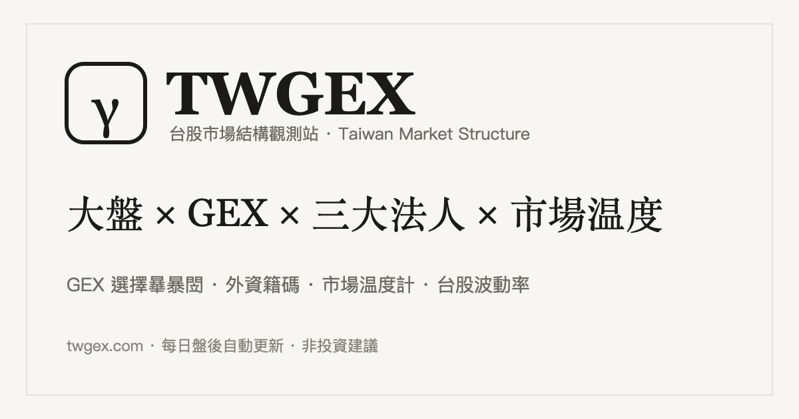

# TWGEX · 台股市場溫度計與市場結構

> 一眼掌握台股市場情緒。每日盤後自動更新，100% 公開資料。
> **Taiwan stock market temperature gauge & market-structure observatory.**
>
> ### 🌡️ [twgex.com](https://twgex.com)



把分散又難讀的台股結構資訊，整理成一目了然的圖表——像看天氣預報一樣，3 秒掌握市場狀態。

## 看什麼

| 指標 | 說明 |
|------|------|
| **市場溫度計**（0–10）| 外資、內資、散戶與三大法人的籌碼情緒，綜合成一個數字：市場過熱還是過冷 |
| **GEX · 選擇權 Gamma 暴露** | 造市商為維持部位中性所需對沖的 Gamma 總量（百萬／點）|
| **聰明錢方向** | 三大法人「現貨＋期貨」淨部位的 252 日相對分位（1 空 ~ 10 多）|
| **量價結構** | 垂直量 ＋ 橫向量（Volume Profile）價值區 |
| **台VIX（HV21）** | 加權指數近 21 日報酬的年化已實現波動率 |

## 特色

- 🌡️ **3 秒看懂**：溫度計當門面，往下滾才是進階的 GEX／結構
- 🔄 **每日盤後自動更新**：GitHub Actions 雲端 cron（台灣 18:30），不需開機
- 📊 **100% 公開資料**：臺灣證券交易所（TWSE）、臺灣期貨交易所（TAIFEX）、FinMind，依政府資料開放授權（OGDL v1.0）
- 🌐 **中英雙語**
- ⚖️ **純市場資訊觀測，非投資建議**——零個股、零方向、零買賣建議

## 把溫度計嵌入你的網站／部落格

```html
<iframe src="https://twgex.com/widget/temperature.html"
        width="360" height="320" style="border:0;" loading="lazy"
        title="台股市場溫度計 · TWGEX"></iframe>
<p>台股市場溫度計 by <a href="https://twgex.com">TWGEX</a></p>
```

溫度計會自動顯示當日最新數值。歡迎自由嵌入，附上來源連結即可。

## 技術

純靜態網站（GitHub Pages）+ GitHub Actions 排程 + [lightweight-charts](https://github.com/tradingview/lightweight-charts)。
`fetch_market.py` 抓公開資料 → `compute.py` 計算（Black-Scholes gamma、rolling 分位、HV21）→ 輸出 `site/data.json` → 自動部署。各指標計算方法見[說明頁](https://twgex.com/method.html)。

## 免責聲明

本專案所提供之台股市場結構資訊，均為對公開市場資料之整理與計算，屬一般性市場資訊。**不針對任何個別有價證券提供分析意見或推介建議，不構成投資建議。** 投資有風險，使用者應自行判斷並承擔風險。

---

資料來源：臺灣證券交易所（TWSE）、臺灣期貨交易所（TAIFEX）、FinMind ｜ 網站：**[twgex.com](https://twgex.com)**
